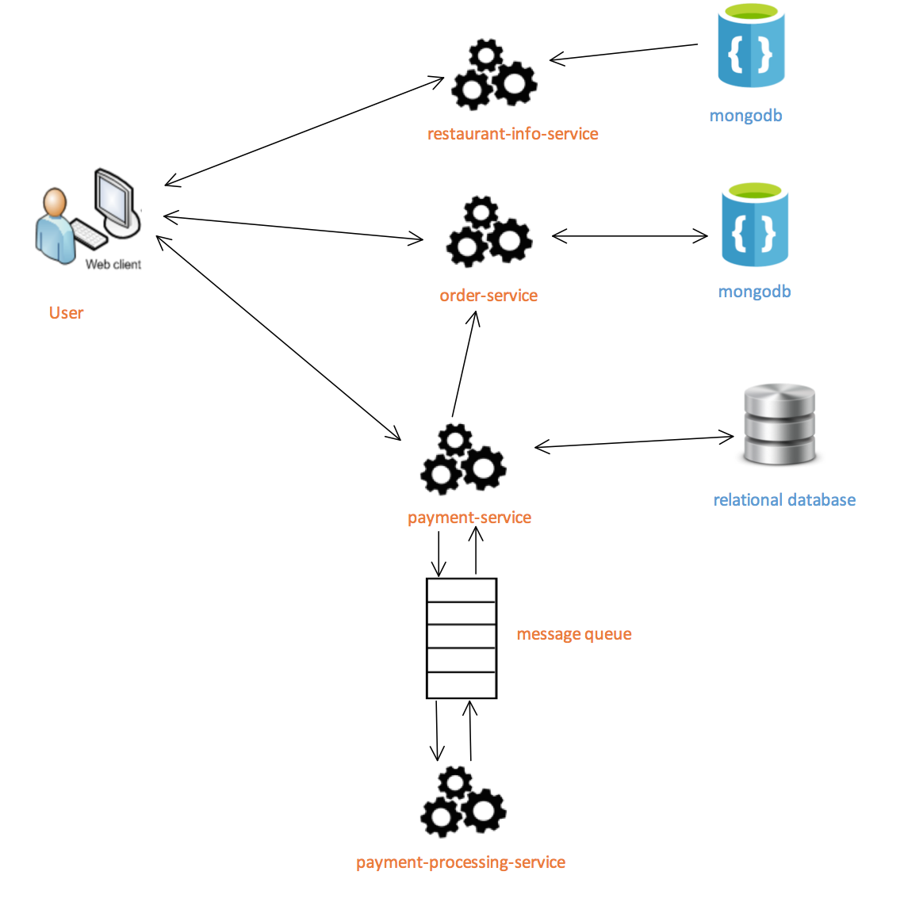

# food-delivery-app
Spring Boot application based on microservices architecture. 

### System Architecture

> Detailed information about each service can be found in service folder.

### Requirements
- Java JDK 8
- Apache Maven
- Docker

### Get Started
1. Run `docker-compose up -d` to start MongoDB and Rabbitmq if you don't have them on your local computer.
2. Build then start services:  
restaurant-info-service --> order-service --> payment-service --> payment-processing-service.
3. Upload restaurant test data in `restaurant.json`.
4. Open restaurant UI on http://localhost:8080
